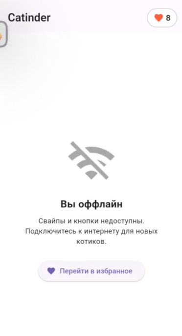

# Catinder

Приложение для знакомства с котами через свайпы 🐾

## 📱 Скриншоты


*Главный экран: карточка котика с кнопками лайк/дизлайк*

---


*Избранные котики: удаление и фильтрация*

---

  

*Экран деталей: информация о породе кота*

---


  

*Экран в случае отсутствия сети (экран лайков доступен и не меняется)*

---

## ✨ Возможности

- Свайп карточек влево/вправо
- Кнопки лайк/дизлайк
- Счетчик понравившихся котиков
- Детальная информация о породе
- Автоматическая подгрузка новых котиков
- Список лайкнутых котиков
- Возможность удаления из списка лайкнутых по свайпу/кнопке
- Фильтрация списка лайкнутых по породе
- Индикатор загрузки 
- AlertDialog «нет интернета» 
- Оффлайн-режим: просмотр ранее лайкнутых котиков без сети
- Картинки доступны оффлайн (кэширование изображений через cached_network_image)
- Сохранение лайков/дизлайков между запусками 
- Неблокирующий баннер при потере сети, с блокировкой свайпов и кнопок лайка/дизлайка, но с сохранением доступа к списку лайкнутых
- Отслеживания статуса сети и мгновенное реагирование (connectivity_plus)


---


## 📥 Скачать APK

[Последняя версия приложения](https://drive.google.com/file/d/1kVijHfIZOP4aDsOsXc_LQ2CRu_qyTayp/view?usp=share_link)

---

> Примечание: Для работы приложения требуется [API-ключ TheCatAPI](https://thecatapi.com/signup).  

> Для запуска из терминала:   
>```flutter run --dart-define=CAT_API_KEY=ВАШ-КЛЮЧ```