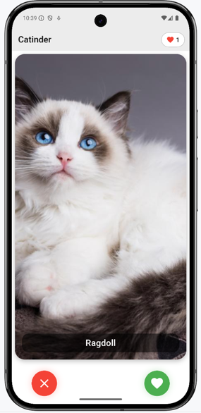
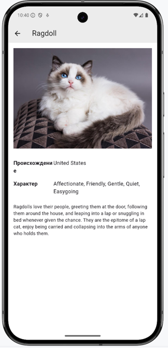

# Catinder

Приложение для знакомства с котами через свайпы 🐾

## 📱 Скриншоты

*Главный экран: карточка котика с кнопками лайк/дизлайк*

---

  

*Экран деталей: информация о породе кота*

---

  

*Экран загрузки*

---

## ✅ Функционал
- Свайп карточек влево/вправо
- Кнопки лайк/дизлайк
- Счетчик понравившихся котиков
- Детальная информация о породе
- Автоматическая подгрузка новых котиков

---

## 🛠 Технологии
- Flutter 3.7+
- Dart 3.0+
- [TheCatAPI](https://thecatapi.com/)
- CachedNetworkImage

---

## 📥 Скачать APK

[Последняя версия приложения](https://drive.google.com/file/d/1W3_lJNll6fIBk_UKLRu2XvpAO32wp8VM/view?usp=share_link)

---

> Примечание: Для работы приложения требуется [API-ключ TheCatAPI](https://thecatapi.com/signup).  
