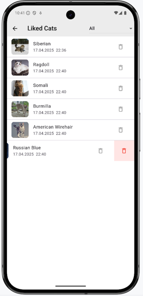

# Catinder

Приложение для знакомства с котами через свайпы 🐾

## 📱 Скриншоты


*Главный экран: карточка котика с кнопками лайк/дизлайк*

---



*Избранные котики: удаление и фильтрация*

---

  

*Экран деталей: информация о породе кота*

---

## ✨ Возможности

- Свайп карточек влево/вправо
- Кнопки лайк/дизлайк
- Счетчик понравившихся котиков
- Детальная информация о породе
- Автоматическая подгрузка новых котиков
- Список лайкнутых котиков
- Возможность удаления из списка лайкнутых по свайпу/кнопке
- Фильтрация списка лайкнутых по породе
- Индикатор загрузки 
- AlertDialog «нет интернета» 

---


## 📥 Скачать APK

[Последняя версия приложения](https://drive.google.com/file/d/1qzNFdsFaw1hnBe5_4E1dqPE_TYIVHn6v/view?usp=share_link)

---

> Примечание: Для работы приложения требуется [API-ключ TheCatAPI](https://thecatapi.com/signup).  

> Для запуска из терминала:   
>```flutter run --dart-define=CAT_API_KEY=ВАШ-КЛЮЧ```